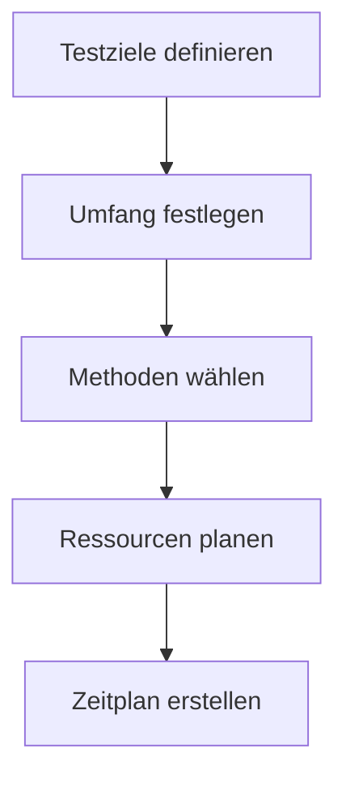

Das **Testkonzept** beschreibt den strategischen Rahmen für Tests in der Softwareentwicklung. Es definiert, was, wie, womit und wann getestet wird, um Qualität und Funktionalität einer Anwendung sicherzustellen und Risiken frühzeitig zu erkennen.

## Inhalt des Artikels

Der Artikel behandelt:

- Den Unterschied zwischen Testkonzept und Testplan.
- Testziele und -umfang.
- Verschiedene Testmethoden und -arten.
- Testressourcen und -zeitpläne.
- Risikobasierte Testpriorisierung.

## Kontext und Einordnung

Ein Testkonzept dient als Grundlage für alle Testaktivitäten und unterscheidet sich vom Testplan, der operative Details wie Termine und Meilensteine enthält. Es minimiert Risiken durch frühzeitige Fehlererkennung, spart Kosten, da Fehler in frühen Phasen günstiger behoben werden, und fördert die Nachvollziehbarkeit der Testaktivitäten.

## Testziele und Testumfang

Testziele legen spezifische Qualitätsaspekte fest, wie Funktionalität, Benutzerfreundlichkeit, Leistung und Sicherheit. Der Testumfang definiert, welche Funktionen und Komponenten getestet werden, und grenzt aus, was nicht getestet wird. Risikobasierte Priorisierung stellt sicher, dass kritische Bereiche intensiver geprüft werden als weniger wichtige.

## Vorgehen

1. Testziele definieren: Festlegung klarer, messbarer Ziele.
2. Umfang festlegen: Bestimmung von In-scope- und Out-of-Scope-Bereichen.
3. Methoden wählen: Auswahl passender Testarten.
4. Ressourcen planen: Zuweisung von Testumgebungen, Werkzeugen und Personal.
5. Zeitplan erstellen: Festlegung von Phasen und Meilensteinen.
6. Risiken priorisieren: Bevorzugung kritischer Funktionen.

## Beispiele

In einem Datenanalyse-Tool könnte der Umfang Funktionen wie Datenimport und Berichterstellung umfassen, während externe APIs ausgeschlossen werden. Ein Beispiel für risikobasierte Priorisierung: Hohe Priorität für Sicherheitsprüfungen bei sensiblen Daten, niedrige für kosmetische UI-Elemente.

Dieses Diagramm zeigt den grundlegenden Ablauf der Testkonzept-Erstellung.

## Testmethoden und -arten

Testmethoden umfassen manuelle und automatisierte Ansätze sowie Whitebox- und Blackbox-Tests. Häufige Testarten sind:

- **Funktionale Tests**: Überprüfen, ob Anforderungen erfüllt werden, basierend auf [Funktionale und nicht-funktionale Anforderungen](funktionale-und-nicht-funktionale-anforderungen).
- **Usability-Tests**: Bewerten die Benutzerfreundlichkeit, unterstützt durch [Softwareergonomie](softwareergonomie).
- **Leistungstests**: Prüfen Reaktionszeiten und Stabilität, wie in der [Systemlastanalyse](systemlastanalyse) beschrieben.
- **Sicherheitstests**: Identifizieren Lücken, mit [Präventive IT-Sicherheitsmaßnahmen](praeventive-it-sicherheitsmassnahmen).
- **Andere**: Unit-Tests für einzelne Komponenten, Integrationstests für Zusammenarbeit und End-to-End-Tests für vollständige Abläufe.

## Testressourcen und -zeitplan

Ressourcen umfassen Testumgebungen, die der Produktion ähneln sollten, Werkzeuge wie [Testdatengeneratoren](testdatengeneratoren) und Personal. Der Zeitplan beschreibt Phasen wie Planung, Durchführung und Abschluss, mit Meilensteinen vor der Veröffentlichung.

## Häufige Fehler und Tipps

- Verwechslung von Testkonzept und Testplan vermeiden; ersteres ist strategisch, letzteres operativ.
- Zu breiter Umfang verschwendet Ressourcen; Fokus auf Risiken ist empfehlenswert.
- Testumgebungen sollten Produktionsumgebungen nachahmen, um realistische Ergebnisse zu erhalten.
- Destructive Tests nur in dedizierten Umgebungen durchzuführen.
- Smoke-Tests nach Deployments nutzen, um grundlegende Funktionalität schnell zu prüfen.

## Selbsttest

1. Was ist der Hauptunterschied zwischen Testkonzept und Testplan?
2. Welche drei Testarten gibt es und was sind ihre Zwecke?
3. Warum ist risikobasierte Priorisierung wichtig?
4. Welche Ressourcen werden typischerweise im Testkonzept geplant?
5. Wie sieht ein Beispiel für risikobasierte Priorisierung in der Datenanalyse aus?

## Weiterführendes

Für detaillierte Verfahren siehe [Testverfahren](testverfahren).
