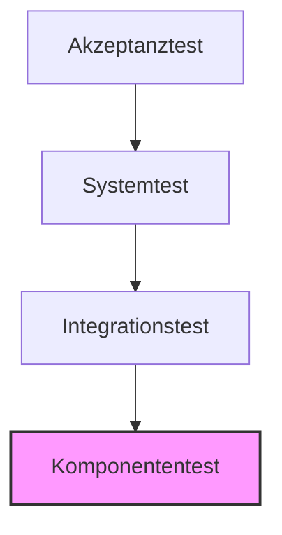

**Testverfahren** bezeichnen systematische Ansätze und Techniken zur Überprüfung der Softwarequalität. Ziel ist es, Fehler frühzeitig zu identifizieren, die Übereinstimmung mit den definierten [Anforderungen](funktionale-und-nicht-funktionale-anforderungen) sicherzustellen und die Zuverlässigkeit des Systems zu erhöhen. Grundsätzlich wird zwischen der Prüfung von Arbeitsergebnissen ohne Programmausführung (statisch) und der Verifikation des Laufzeitverhaltens (dynamisch) unterschieden.

## Lernziele
Dieser Artikel vermittelt die Grundlagen zur Einordnung und Anwendung verschiedener Testansätze:

*   Unterscheidung zwischen statischen und dynamischen Testverfahren.
*   Einordnung der Teststufen innerhalb der Testpyramide.
*   Abgrenzung von Black-Box-, White-Box- und Grey-Box-Testing.
*   Anwendung der Grenzwertanalyse zur effizienten Testfallermittlung.
*   Bestimmung passender Testzeitpunkte im Software-Lebenszyklus.

## Klassifizierung der Verfahren
Die Softwareprüfung wird in zwei Kategorien unterteilt, die sich gegenseitig ergänzen und unterschiedliche Fehlertypen adressieren.

### Statische Testverfahren
Statische Tests erfolgen ohne Ausführung des Quellcodes. Der Fokus liegt auf der Prüfung von Dokumenten wie [Spezifikationen](software-anforderungen) oder Konzepten sowie dem Code selbst.

*   **Reviews**: Systematische Sichtung von Dokumenten durch Experten oder Teammitglieder, um Unstimmigkeiten oder Lücken frühzeitig zu identifizieren.
*   **Statische Analyse**: Automatisierte Prüfung des Quellcodes auf Einhaltung von Programmierrichtlinien, Komplexität oder Sicherheitsrisiken.
*   **Walkthrough**: Informelles Durchgehen von Dokumenten oder Code zur Förderung des gemeinsamen Verständnisses im Team.

### Dynamische Testverfahren
Dynamische Tests erfordern die Ausführung der Software. Dabei wird das tatsächliche Verhalten des Systems gegen die Erwartungen geprüft. Dies umfasst funktionale Tests sowie nicht-funktionale Aspekte wie Performance oder Sicherheit.

| Aspekt | Statische Testverfahren | Dynamische Testverfahren |
| :--- | :--- | :--- |
| **Code-Ausführung** | Nein | Ja |
| **Fokus** | Dokumentation, Struktur, Logik | Funktionalität, Laufzeitverhalten |
| **Primäres Ziel** | Frühe Fehlererkennung (Prävention) | Fehlersuche (Detektion) |
| **Beispiele** | Review, statische Codeanalyse | Komponententests, Systemtests |

## Teststufen und die Testpyramide
Tests werden in Stufen unterteilt, die aufeinander aufbauen. Das Modell der Testpyramide verdeutlicht, dass eine breite Basis an schnellen, kleinteiligen Tests durch weniger, aber komplexere Tests an der Spitze ergänzt werden sollte.

1.  **Komponententest (Unit-Test)**: Prüfung der kleinsten testbaren Einheiten (z. B. Funktionen oder Klassen), meist automatisiert durch die Entwicklung.
2.  **Integrationstest**: Überprüfung des Zusammenwirkens mehrerer Komponenten oder Teilsysteme.
3.  **Systemtest**: Test des Gesamtsystems in einer produktionsnahen Umgebung gegen die ursprünglichen Anforderungen.
4.  **Akzeptanztest (Abnahmetest)**: Validierung durch Endbenutzer oder Kunden als formale Voraussetzung für die Inbetriebnahme (siehe auch [Abnahmeprotokoll](abnahmeprotokoll)).

*Abbildung: Hierarchischer Aufbau der Teststufen; die Anzahl der Tests nimmt nach oben hin ab.*

## Testentwurfsverfahren
Je nach Informationsstand über die internen Abläufe des Testobjekts werden drei Ansätze unterschieden:

### Black-Box-Testing
Das System wird als geschlossene Einheit betrachtet. Der Testentwurf basiert ausschließlich auf Spezifikationen und Anforderungen, ohne Kenntnis des internen Quellcodes.

*   **Vorteil**: Unabhängigkeit von der technischen Umsetzung; Fokus auf die Nutzersicht.
*   **Nachteil**: Interne Logikpfade oder Randfälle könnten unberücksichtigt bleiben.

### White-Box-Testing
Der Fokus liegt auf der internen Struktur und dem Quellcode. Testfälle werden so entworfen, dass gezielte Pfade, Bedingungen oder Schleifen im Code durchlaufen werden.

*   **Vorteil**: Hohe Transparenz der internen Logik; gezielte Identifikation von Implementierungsfehlern.
*   **Nachteil**: Erfordert technisches Detailwissen und Zugriff auf den Quellcode.

### Grey-Box-Testing
Eine Mischform, bei der begrenztes Wissen über Interna vorhanden ist (z. B. Datenbankstrukturen oder API-Definitionen), der Test jedoch primär funktional durchgeführt wird.

## Grenzwertanalyse
Die Grenzwertanalyse ist ein effizientes Black-Box-Verfahren. Da Fehler häufig an den Grenzen von Eingabebereichen auftreten, werden gezielt Werte an diesen Rändern geprüft.

> **Beispiel**: Ein Eingabefeld akzeptiert Werte von 1 bis 100.
> *   **Relevante Testwerte**: 0 (ungültig), 1 (Grenze), 2 (innerhalb), 99 (innerhalb), 100 (Grenze), 101 (ungültig).

## Häufige Fehler und Empfehlungen

*   **Fehler**: Die Testplanung erfolgt erst nach Abschluss der Entwicklung.
    *   **Lösung**: Die Testplanung sollte bereits während der Anforderungsphase beginnen, um teure Spätkorrekturen zu vermeiden.
*   **Fehler**: Fokus auf manuellen Systemtests statt automatisierter Komponententests.
    *   **Lösung**: Eine stabile Testpyramide mit hohem Automatisierungsgrad auf Komponentenebene sorgt für schnelles Feedback.

## Selbsttest

1. Worin besteht der Hauptunterschied zwischen statischen und dynamischen Tests?
2. Warum bilden Komponententests die Basis der Testpyramide?
3. Welche Teststufe dient der finalen Validierung durch den Kunden?
4. Welche Werte sind bei einer Grenzwertanalyse für einen Bereich von 10 bis 50 (einschließlich) zu wählen?
