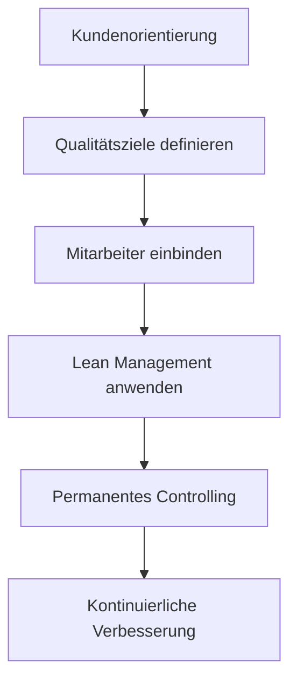

**Total Quality Management** ist ein ganzheitlicher Ansatz zur Qualitätsverbesserung in Unternehmen. Er bindet alle Mitarbeiter ein und fördert kontinuierliche Verbesserungen. Der Ansatz findet in allen Branchen und Unternehmensgrößen Anwendung und zielt auf die Maximierung der Kundenzufriedenheit ab. TQM integriert alle Mitarbeiter in den Prozess der Qualitätsverbesserung und nutzt Prinzipien wie Kundenorientierung und kontinuierliche Verbesserung zur Optimierung.

## Kurzübersicht
Total Quality Management stellt Qualität als oberstes Unternehmensziel dar und geht über traditionelle Qualitätskontrollen hinaus. Es behandelt Qualität als kontinuierlichen Prozess, der alle Hierarchiestufen und Funktionsbereiche einschließt. Im Gegensatz zum klassischen Qualitätsmanagement, das sich auf Fehlervermeidung konzentriert, fördert TQM eine Kultur der Zusammenarbeit und ständigen Optimierung. Typische Anwendungsgebiete sind Produktions- und Dienstleistungsunternehmen, wo es zur Steigerung der Effizienz und Kundenzufriedenheit beiträgt.

## Historische Entwicklung
Die Ursprünge des Total Quality Management liegen in den 1940er Jahren in den USA. William Edwards Deming und Walter A. Shewhart entwickelten Ideen zur statistischen Qualitätskontrolle und kontinuierlichen Verbesserung. Diese Konzepte fanden zunächst wenig Beachtung in den USA, wurden aber in Japan nach dem Zweiten Weltkrieg erfolgreich angewendet. Insbesondere das Toyota-Produktionssystem integrierte TQM-Prinzipien und führte zum Deming-Preis im Jahr 1951, der japanische Unternehmen für Qualitätsleistungen auszeichnete. In den 1970er und 1980er Jahren kehrte TQM in die USA zurück, unterstützt durch den Malcolm Baldrige National Quality Award (1987). In Europa gründete sich 1988 die European Foundation for Quality Management (EFQM), die das [EFQM-Modell](efqm-modell) als Bewertungsinstrument entwickelte.

## Kernprinzipien des TQM
TQM basiert auf acht Kernprinzipien der American Society for Quality (ASQ). Diese Prinzipien bilden die Grundlage für die Umsetzung:

- **Kundenorientierung**: Qualität wird ausschließlich an den Anforderungen und Erwartungen der Kunden definiert. Alle Prozesse richten sich an deren Wünschen aus.
- **Einbeziehung aller Organisationsmitglieder**: Alle Mitarbeiter, von der Führung bis zur Produktion, werden in Qualitätsverbesserungen einbezogen, um Motivation und Kreativität zu fördern.
- **Prozessfokus**: Qualität entsteht durch optimierte Prozesse, nicht durch nachträgliche Kontrollen. Fehler werden als Prozessschwächen betrachtet.
- **Integration**: Qualitätsziele werden in die Gesamtstrategie des Unternehmens integriert.
- **Strategischer und systemischer Ansatz**: Qualitätsmanagement erfolgt systematisch und langfristig orientiert.
- **Kontinuierliche Optimierung**: Ständige Verbesserungen (Kaizen) sind zentral, um Wettbewerbsvorteile zu erhalten.
- **Faktenbasierte Entscheidungsfindung**: Entscheidungen stützen sich auf Daten und Analysen, nicht auf Annahmen.
- **Kommunikation**: Offene Kommunikation fördert den Austausch von Wissen und Ideen zur Qualitätsverbesserung.

Diese Prinzipien werden in einem Diagramm visualisiert, das den Zusammenhang zwischen Kundenorientierung und kontinuierlicher Verbesserung zeigt:

## Methodische Umsetzung
TQM wird durch verschiedene Methoden praktisch umgesetzt. Der [PDCA-Zyklus](pdca-zyklus) dient als zyklischer Ansatz zur Verbesserung: In der Plan-Phase werden Ziele definiert, in der Do-Phase Maßnahmen ergriffen, in der Check-Phase Ergebnisse überprüft und in der Act-Phase Verbesserungen implementiert. Dies wiederholt sich kontinuierlich.

Das [EFQM-Modell](efqm-modell) bewertet Unternehmen anhand von Kriterien wie Führung, Strategie und Ergebnisse. Im Gegensatz zu zertifizierbaren Normen wie ISO 9001 ist es ein reines Bewertungsmodell. Verwandte Ansätze wie Lean Management erweitern TQM um Verschwendungsreduktion, wie im Toyota-Produktionssystem praktiziert.

## Beispiele
Ein Beispiel für den PDCA-Zyklus in einem Produktionsunternehmen: In der Plan-Phase wird ein hoher Ausschuss bei einem Produkt identifiziert. Do: Neue Schulungen für Mitarbeiter. Check: Reduzierung des Ausschusses um 20 %. Act: Schulungen standardisieren und weiter verbessern.

## Vorteile und Herausforderungen
TQM bringt messbare Vorteile: Studien zeigen, dass Unternehmen mit TQM-Ansatz bis zu 44 % höhere Aktienkurse, 48 % höhere Betriebserträge und 37 % höhere Umsätze erreichen. Es reduziert Fehler, steigert die Effizienz und stärkt die Kundenzufriedenheit.

Herausforderungen liegen in der Unternehmenskultur: Die Einführung erfordert Veränderungen, die Widerstände hervorrufen können. Bei kurzfristigen Erwartungen fällt es schwer, Qualität als langfristige Philosophie zu verankern. Mangelnde Akzeptanz führt zu Konflikten, und die Einhaltung strikter Abläufe ist bei vielen Beteiligten komplex.

## Gegenüberstellung TQM vs. klassische Qualitätssicherung
TQM unterscheidet sich vom klassischen Qualitätsmanagement durch seinen ganzheitlichen Ansatz. Klassisches Qualitätsmanagement konzentriert sich auf Planung, Steuerung und Überwachung von Prozessen, während TQM Qualität als Systemziel in allen Bereichen verankert. Eine tabellarische Übersicht:

| Aspekt                  | Klassische Qualitätssicherung | Total Quality Management |
|-------------------------|-------------------------------|--------------------------|
| Fehlerursache          | Menschen machen Fehler        | Prozesse haben Schwächen |
| Ziel                    | Akzeptierte Fehlerquote       | Null-Fehler-Ziel         |
| Ansatz                  | Reaktiv (Kontrolle)           | Proaktiv (Verbesserung)  |
| Beteiligung            | Spezialisierte Abteilungen    | Alle Mitarbeiter         |
| Fokus                   | Produkte und Dienstleistungen | Ganzes Unternehmen       |

## Häufige Fehler und Tipps
Ein häufiger Fehler ist die Annahme, dass TQM nur für große Unternehmen gilt; es lässt sich jedoch in kleinen Betrieben skalieren. Ein Fehler ist die Behandlung von TQM als einmalige Initiative. Die Etablierung als kontinuierlicher Prozess ist für die langfristige Wirkung erforderlich. Datenanalyse hilft, faktenbasierte Entscheidungen zu treffen und Fehler früh zu erkennen.
