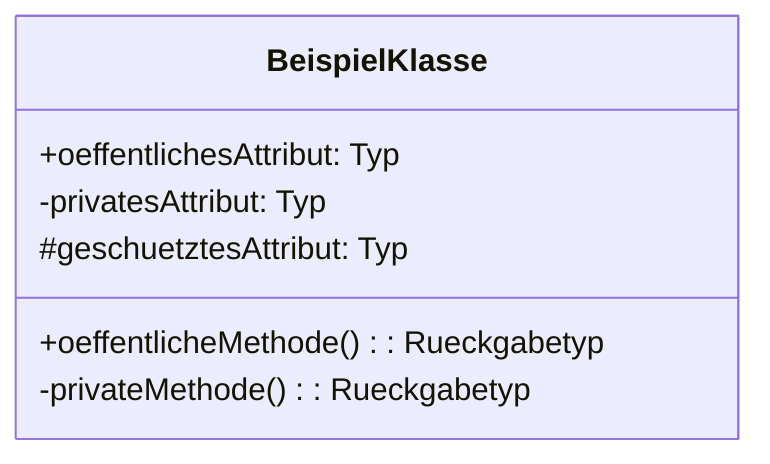
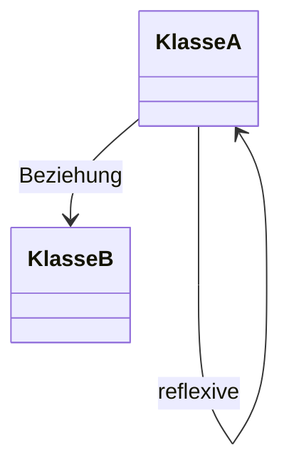
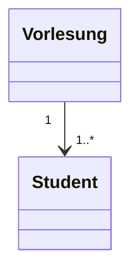
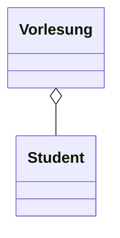
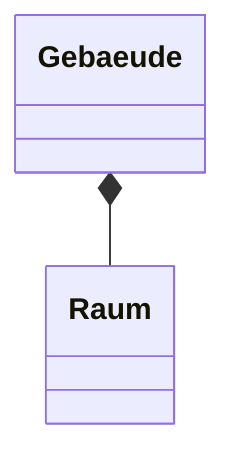
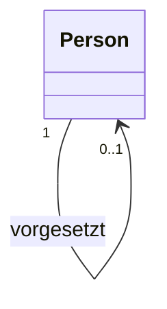

Das UML-Klassendiagramm ist ein Strukturdiagramm der Unified Modeling Language ([UML](uml)). Es visualisiert die statische Architektur objektorientierter Systeme, indem es Klassen, Schnittstellen sowie deren Attribute, Methoden und Beziehungen darstellt. Zustände oder Interaktionen zeigt es nicht.

## Lernziele

Nach der Lektüre dieses Artikels sind folgende Lernziele erreichbar:

- die Elemente eines UML-Klassendiagramms benennen und beschreiben,
- Beziehungen wie Generalisierung, Assoziation, Aggregation und Komposition unterscheiden,
- Multiplizität und Navigierbarkeit in Diagrammen anwenden,
- Klassendiagramme von anderen UML-Diagrammen abgrenzen,
- einfache Klassendiagramme mit Mermaid erstellen.

## Kurzübersicht

Das UML-Klassendiagramm dient zur Darstellung der statischen Struktur eines Systems. Es umfasst Klassifizierer wie Klassen und Schnittstellen sowie deren Merkmale und Verbindungen. Anders als dynamische Diagramme wie [Zustandsautomat-Diagramme](zustandsautomat-diagramm) konzentriert es sich auf den Aufbau, nicht auf Abläufe oder Zustände.

## Kontext und Einordnung

Klassendiagramme gehören zu den Strukturdiagrammen der UML und unterstützen das Design und die Dokumentation objektorientierter Software. Sie helfen bei der Modellierung von Klassenmodellen, die als Grundlage für Code-Generierung dienen. Abgrenzung zu anderen Diagrammen: Zustände werden durch Zustandsautomaten modelliert, Interaktionen durch [Sequenzdiagramme](sequenzdiagramm) oder [Aktivitätsdiagramme](aktivitaetsdiagramm).

## Begriffe und Definitionen

### Klasse

Eine Klasse ist ein Klassifizierer mit Attributen und Operationen, der eine Menge von Objekten mit gemeinsamen Eigenschaften beschreibt. Klassennamen sind Substantive im Singular. Attribute beschreiben Zustände, Operationen das Verhalten.

Sichtbarkeiten zeigen Zugriffsebenen an:

- `+`: öffentlich (public) – zugänglich von überall,
- `-`: privat (private) – nur innerhalb der Klasse,
- `#`: geschützt (protected) – innerhalb der Klasse und Unterklassen.

### Schnittstelle

Eine Schnittstelle definiert Methodensignaturen ohne Implementierung. Sie wird mit dem Stereotyp `<<interface>>` gekennzeichnet und unterstützt Polymorphie durch Implementierung in Klassen.

## Vorgehen

### Elemente darstellen

Klassen und Schnittstellen werden als Rechtecke gezeichnet. Attribute und Operationen sind darin aufgelistet, mit Sichtbarkeitssymbolen.



Schnittstellen werden ähnlich dargestellt, aber ohne Attribute:

```mermaid
classDiagram
    class <<interface>> ISensor {
        +messungDurchfuehren(): float
    }
```

### Beziehungen modellieren

#### Generalisierung

Eine Generalisierung stellt Vererbung dar. Dabei erben Unterklassen Merkmale von Oberklassen. Dargestellt durch einen Pfeil mit ausgefülltem Dreieck an der Oberklasse.

```mermaid
classDiagram
    <<interface>> ISensor <|-- Waermesensor
```

#### Assoziation

Eine Assoziation verbindet zwei Klassen. Sie kann gerichtet sein (Navigierbarkeit: einseitiger Pfeil), um anzugeben, welche Klasse die Beziehung kennt. Reflexive Assoziationen beziehen sich auf die gleiche Klasse.



#### Multiplizität

Multiplizität gibt die Anzahl beteiligter Objekte an, z. B. `1` (genau eins), `0..1` (null oder eins), `1..*` (eins oder mehr), `*` (beliebig viele).



#### Aggregation und Komposition

Aggregation (leere Raute) zeigt eine lose "Teil-von"-Beziehung; Teile können mehreren Aggregaten angehören und überleben das Aggregat.



Komposition (ausgefüllte Raute) zeigt eine starke "Teil-von"-Beziehung mit gemeinsamem Lebenszyklus; Teile gehören genau einem Kompositum und werden mit diesem gelöscht.



## Beispiele

### Einfaches Klassenmodell

Ein Sensor-System: Ein Wärmesensor implementiert ISensor und aggregiert Messwerte.

```mermaid
classDiagram
    <<interface>> ISensor <|-- Waermesensor
    Waermesensor o-- Messwert
    Waermesensor "1" --> "0..*" Messwert : aggregiert
```

### Reflexive Assoziation

Eine Person kann Vorgesetzte von anderen Personen sein.



## Häufige Fehler und Tipps

- Aggregation und Komposition nicht mit einfacher Assoziation verwechseln; Aggregation nur bei loser Teile-Beziehung, Komposition bei starker Abhängigkeit verwenden.
- Vermeide Über-Engineering: Beginnen mit Assoziationen und Hinzufügen von Spezialisierungen, wenn nötig.
- Konsistente Benennung verwenden: Klassennamen singular, Attribute deskriptiv.
- Zustände nicht in Klassendiagramme einbauen; dafür Zustandsautomaten verwenden.

## Selbsttest

1. Was zeigt ein UML-Klassendiagramm primär? (Statische Struktur)
2. Wie wird Sichtbarkeit in UML notiert? (Mit +, -, #)
3. Unterschied Aggregation vs. Komposition? (Aggregation: lose, Teile überleben; Komposition: stark, gemeinsamer Lebenszyklus)
4. Was ist Multiplizität? (Anzahl beteiligter Objekte)
5. Wann wird Generalisierung verwendet? (Für Vererbung)