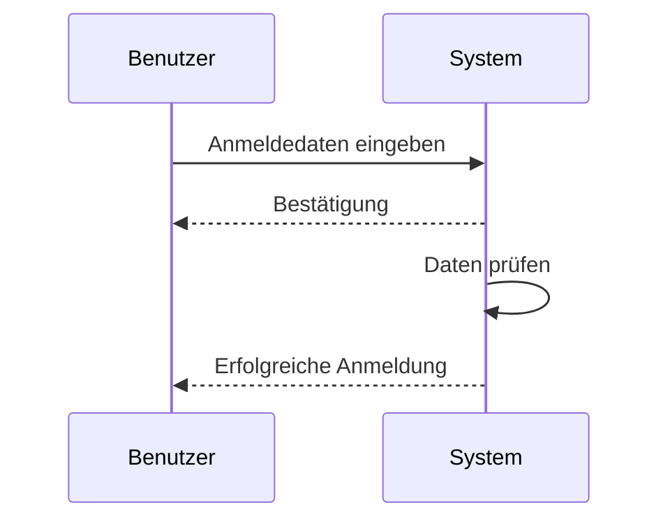
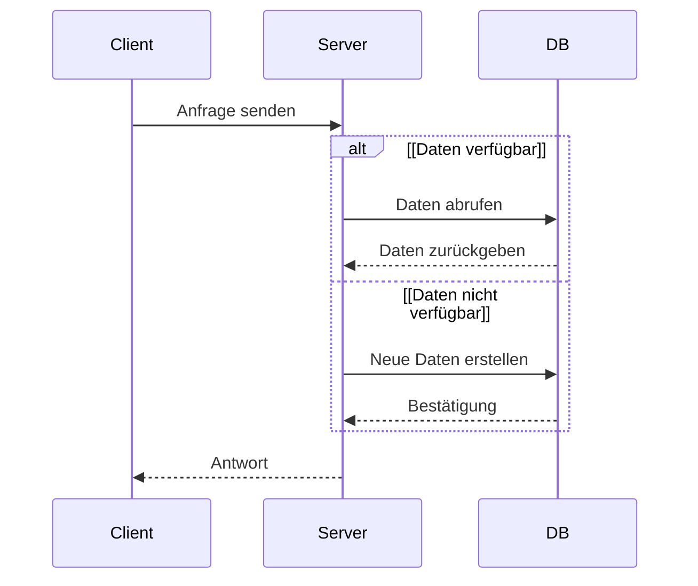

Der **UML-Sequenzdiagramm** ist ein Diagrammtyp der Unified Modeling Language (UML) und visualisiert den zeitlichen Ablauf von Interaktionen zwischen Partizipanten in einem System. Der Schwerpunkt liegt auf der chronologischen Abfolge der Nachrichten zwischen Lifelines, ohne dass absolute Zeitangaben betont werden. Im Gegensatz zu anderen UML-Diagrammen wie dem [Klassendiagramm](uml-klassendiagramm), das statische Strukturen abbildet, konzentriert es sich auf dynamische Aspekte.

## Kurzüberblick

Das UML-Sequenzdiagramm zählt zu den Interaktionsdiagrammen der UML und stellt dynamische Aspekte eines Systems dar. Es veranschaulicht, wie Objekte und Akteure im Laufe der Zeit Nachrichten austauschen. Die vertikale Achse steht für den Zeitverlauf von oben nach unten, während horizontale Linien die Partizipanten verbinden. Das Diagramm unterstützt die Analyse von Use Cases und die Spezifikation von Systemverhalten.

## Kontext und Einordnung

Sequenzdiagramme ergänzen andere UML-Diagramme wie Aktivitätsdiagramme oder Zustandsdiagramme, indem sie den Fokus auf zeitliche Abläufe legen. Sie finden Anwendung in der Softwareentwicklung zur Modellierung von Kommunikationsprotokollen, API-Interaktionen oder Geschäftsprozessen. Im Vergleich zum [UML](uml)-Gesamtkonzept betonen sie Interaktionen statt Strukturen.

## Begriffe und Definitionen

- **Lifeline**: Eine vertikale Linie, die den Lebenszyklus eines Partizipanten darstellt, oft mit einem Rechteck oben zur Bezeichnung (z. B. `objekt:Klasse`).
- **Execution Specification**: Ein rechteckiger Bereich auf einer Lifeline, der die aktive Phase eines Objekts anzeigt.
- **Nachricht**: Eine Kommunikation zwischen Lifelines, gekennzeichnet durch Pfeile (synchrone: gefüllter Pfeilkopf, asynchrone: offener Pfeilkopf).
- **Combined Fragment**: Ein Rahmen, der bedingte oder iterative Interaktionen gruppiert, mit Operatoren wie `alt` oder `loop`.

## Grundelemente

Sequenzdiagramme bestehen aus folgenden Elementen:

1. **Partizipanten**: Akteure oder Objekte, repräsentiert durch Lifelines.
2. **Nachrichten**:
   - Synchrone Nachrichten: Der Sender wartet auf eine Antwort.
   - Asynchrone Nachrichten: Keine Wartezeit erforderlich.
   - Return-Nachrichten: Antworten, dargestellt mit gestricheltem Pfeil.
   - Create-Nachrichten: Erstellung neuer Objekte.
   - Delete-Nachrichten: Zerstörung von Objekten.
3. **Execution Specifications**: Aktivierungsbalken auf Lifelines.

## Kombinierte Fragmente

Kombinierte Fragmente ermöglichen die Modellierung komplexer Abläufe mit Bedingungen und Wiederholungen. Sie umfassen einen Bereich mit einem Operator und optionalen Guards in eckigen Klammern.

- **alt (Alternative)**: Wählt einen von mehreren Pfaden basierend auf einer Bedingung aus.
- **opt (Optional)**: Führt einen Pfad aus, wenn die Bedingung erfüllt ist.
- **loop (Schleife)**: Wiederholt einen Pfad, solange die Bedingung gilt.
- **par (Parallel)**: Führt Pfade parallel aus.
- **break (Ausnahme)**: Beendet das umfassende Fragment bei Erfüllung der Bedingung.
- **critical (Kritisch)**: Markiert atomare Abschnitte.

Guards sind Bedingungen wie `[x > 0]`, die den Ausführungspfad steuern.

## Beispiele

### Einfaches Beispiel: Anmeldung

Das Diagramm zeigt eine synchrone Nachricht mit Rückgabe.

### Beispiel mit Combined Fragment: Bedingte Verarbeitung

Das Diagramm modelliert mit `alt` eine Alternative mit Guards.

## Häufige Fehler und Tipps

- Verwechslung von synchronen und asynchronen Nachrichten: Synchrone Nachrichten blockieren den Sender; asynchrone nicht.
- Absolute Zeitangaben: Sequenzdiagramme zeigen Reihenfolge, nicht genaue Dauern.
- Lifelines vs. Objekte: Lifelines repräsentieren Instanzen, nicht Klassen.
- Einfache Diagramme bilden die Grundlage; Combined Fragments können schrittweise hinzugefügt werden.
