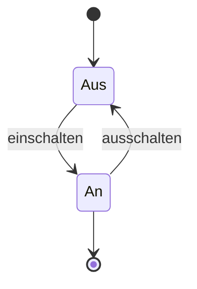
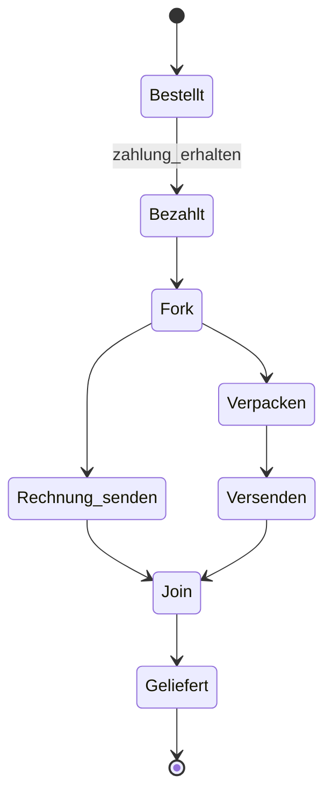
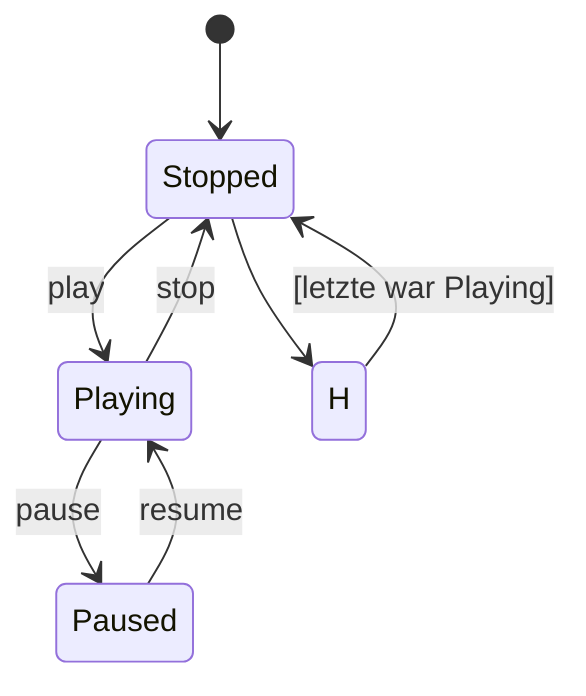

Das **UML-Zustandsdiagramm** beschreibt den Lebenszyklus von Objekten oder Systemen durch Zustände und Übergänge. Es zeigt das Verhalten eines Systems über die Zeit und modelliert Verhaltensabläufe in der Softwareentwicklung.

## Lernziele

- Grundelemente eines Zustandsdiagramms kennen und anwenden.
- Pseudozustände wie Fork und Join zur Darstellung paralleler Abläufe verstehen.
- Ereignisse und Bedingungen für Zustandsübergänge definieren.
- Einfache Zustandsdiagramme mit Mermaid erstellen.
- Häufige Fehler bei der Modellierung vermeiden.
- Zustandsdiagramme von anderen UML-Diagrammen wie dem [Aktivitätsdiagramm](uml-aktivitaetsdiagramm) abgrenzen.

## Kurzüberblick
Das UML-Zustandsdiagramm visualisiert Zustände eines Objekts oder Systems sowie mögliche Übergänge. Es basiert auf dem Konzept des endlichen Automaten und strukturiert komplexe Verhaltensmuster. Typische Anwendungen sind Lebenszyklen, wie der Betrieb einer Maschine oder ein Bestellprozess.

## Kontext und Einordnung
Zustandsdiagramme gehören zu den Verhaltensdiagrammen in der Unified Modeling Language ([UML](uml)). Sie konzentrieren sich auf den Zustand eines einzelnen Objekts über die Zeit. Im Gegensatz dazu zeigt das [Sequenzdiagramm](uml-sequenzdiagramm) Interaktionen zwischen Objekten, und das Aktivitätsdiagramm bildet Prozesse und Workflows ab. Zustandsdiagramme eignen sich für Systeme mit klar definierten Zuständen und auslösenden Ereignissen.

## Grundelemente
### Zustände
Zustände stellen eine Phase dar, in der sich ein Objekt befindet. Sie erscheinen als abgerundete Rechtecke und können Aktionen enthalten:

- **Einfacher Zustand**: Grundlegender Zustand ohne Unterstrukturen.
- **Zusammengesetzter Zustand**: Enthält Unterzustände für hierarchische Modelle.

### Transitionen
Transitionen sind gerichtete Pfeile, die einen Wechsel von einem Zustand zum nächsten beschreiben. Ereignisse lösen sie aus, und sie können Bedingungen (Guards) haben. Innere Transitionen führen keine Zustandsänderung herbei, sondern Aktionen innerhalb des Zustands. Äußere Transitionen bewirken einen Zustandswechsel.

### Aktionen
Aktionen definieren, was in einem Zustand geschieht:

- **entry**: Einmal beim Eintritt ausgeführt.
- **exit**: Einmal beim Verlassen ausgeführt.
- **do**: Kontinuierlich, solange der Zustand aktiv ist.

## Pseudozustände
Pseudozustände steuern den Ablauf, ohne echte Zustände darzustellen:

- **Startzustand**: Schwarzer Punkt, Ausgangspunkt des Diagramms.
- **Endzustand**: Schwarzer Punkt mit Kreis, Ende des Diagramms.
- **Entscheidung**: Raute, für bedingte Verzweigungen basierend auf Guards.
- **Fork**: Schwarzer Balken, teilt den Fluss in parallele Pfade.
- **Join**: Schwarzer Balken, vereinigt parallele Pfade.
- **Junction**: Schwarzer Punkt, für einfache Verzweigungen ohne Bedingungen.
- **Eintrittspunkt und Austrittspunkt**: Für zusammengesetzte Zustände, um gleichartige Übergänge zu bündeln.
- **Historie**: Kreis mit H, speichert den letzten Unterzustand; flach (eine Ebene) oder tief (gesamte Hierarchie).

## Ereignisse und Bedingungen
Ereignisse lösen Transitionen aus:

- **Signalereignisse**: Externe Signale wie Benutzereingaben.
- **Zeitereignisse**: Nach Zeitablauf, zum Beispiel after(5s).
- **Änderungsereignisse**: Bei Änderung einer Bedingung, zum Beispiel when(temperature > 100).

Bedingungen (Guards) sind boolesche Ausdrücke in eckigen Klammern. Sie lassen Transitionen nur bei Erfüllung zu, zum Beispiel [zahlung_erfolgt].

## Beispiele
### Einfaches Beispiel: Lampe

### Beispiel mit Parallelisierung: Bestellprozess

### Beispiel mit Historie: Musikplayer

## Häufige Fehler und Tipps

- Zustände nicht mit Aktivitäten verwechseln: Zustände beschreiben Sein, Aktivitäten Tun.
- Zu viele Zustände vermeiden: Bei Komplexität zusammengesetzte Zustände nutzen.
- entry/exit für einmalige Aktionen, do für dauerhafte verwenden.
- Guards immer in eckigen Klammern notieren und klar formulieren.
- Pseudozustände sparsam einsetzen: Nur wenn sie den Ablauf vereinfachen.

## Selbsttest

1. Was unterscheidet einen inneren von einem äußeren Übergang?
2. Wann wird ein Fork-Pseudozustand verwendet?
3. Nenne drei Arten von Ereignissen.
4. Wie wird eine Guard-Bedingung in einem Diagramm dargestellt?
5. Welcher Pseudozustand speichert den letzten Zustand für spätere Wiederherstellung?
6. Grenze Zustandsdiagramme von Aktivitätsdiagrammen ab.

## Weiterführendes
Für tiefergehende Kenntnisse empfiehlt sich die UML-Spezifikation. Praxisbeispiele finden sich in der Modellierung von Embedded-Systemen oder Geschäftsprozessen.