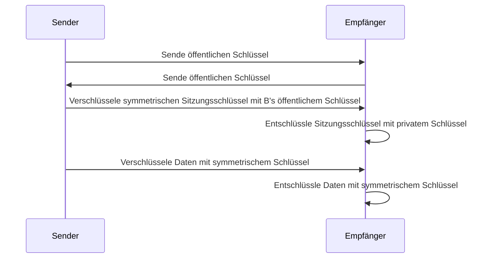

**Verschlüsselungsarten** bezeichnen verschiedene Methoden zur Sicherung von Daten durch Umwandlung in eine unlesbare Form. Symmetrische Verschlüsselung verwendet einen gemeinsamen Schlüssel für Ver- und Entschlüsselung und eignet sich für große Datenmengen. Asymmetrische Verschlüsselung basiert auf einem Schlüsselpaar und ermöglicht sichere Kommunikation ohne vorherigen Schlüsselaustausch. Hybride Verfahren kombinieren beide Ansätze für effiziente Sicherheit.

## Lernziele

Der Artikel vermittelt Kenntnisse zu folgenden Aspekten:

- Grundprinzipien symmetrischer und asymmetrischer Verschlüsselung sowie deren Anwendung.
- Vor- und Nachteile verschiedener Verschlüsselungsarten.
- Das Schlüsselverteilungsproblem bei symmetrischer Verschlüsselung und seine mathematische Beschreibung.
- Hybride Verschlüsselung als Kombination beider Methoden und deren Ablauf.
- Einordnung konkreter Algorithmen wie AES und RSA sowie deren Einsatzgebiete.

## Kurzübersicht

Verschlüsselungsarten lassen sich in drei Hauptgruppen einteilen: symmetrische Verschlüsselung für schnelle Verarbeitung großer Datenmengen, asymmetrische Verschlüsselung für sicheren Schlüsselaustausch und Authentifizierung sowie hybride Verschlüsselung als Kombination beider für optimale Effizienz.

## Kontext und Einordnung

Verschlüsselung ist ein Kernkonzept der Informationssicherheit und dient dem Schutz der Vertraulichkeit von Daten. Sie findet Anwendung in der Daten- und Prozessanalyse, beispielsweise bei der sicheren Übertragung von Analyseergebnissen oder der Speicherung sensibler Daten. Verschlüsselungsarten sind eng mit [Digitaler Signatur](digitale-signatur) und [Datensicherheit](datensicherheit) verbunden.

## Symmetrische Verschlüsselung

### Grundprinzip

Bei der symmetrischen Verschlüsselung wird derselbe geheime Schlüssel sowohl zum Verschlüsseln als auch zum Entschlüsseln von Daten verwendet. Dieser Schlüssel muss vor der Kommunikation sicher zwischen den beteiligten Parteien ausgetauscht werden.

### Vor- und Nachteile

Vorteile: Hohe Geschwindigkeit und Effizienz bei großen Datenmengen.
Nachteile: Herausforderung der sicheren Schlüsselverteilung, da bei n Kommunikationspartnern $$ n(n-1)/2 $$ Schlüssel benötigt werden. Bei 12 Personen sind das bereits 66 Schlüssel, bei 100 Personen 4950 Schlüssel.

### Beispiel-Algorithmen

Ein weit verbreiteter Algorithmus ist AES (Advanced Encryption Standard), eine symmetrische Blockchiffre, die von der US-Regierung standardisiert wurde. Historische Verfahren wie DES sind veraltet und werden nicht mehr empfohlen.

### Einsatzgebiete

Symmetrische Verschlüsselung eignet sich für die Verschlüsselung von Dateien, Datenbanken oder volumetrischen Datentransporten in hybriden Systemen.

## Asymmetrische Verschlüsselung

### Grundprinzip

Die asymmetrische Verschlüsselung verwendet ein mathematisch verbundenes Schlüsselpaar: einen öffentlichen Schlüssel zum Verschlüsseln von Nachrichten oder zur Verifizierung digitaler Signaturen sowie einen privaten Schlüssel zum Entschlüsseln oder zum Erstellen digitaler Signaturen. Der öffentliche Schlüssel kann frei verteilt werden, der private Schlüssel muss absolut geschützt bleiben.

### Vor- und Nachteile

Vorteile: Einfache Schlüsselverteilung und Möglichkeit zur Authentifizierung.
Nachteile: Hoher Rechenaufwand, weshalb sie nicht für große Datenmengen geeignet ist. Die mathematische Basis bilden Einwegfunktionen, wie die Faktorisierung großer Primzahlen.

### Beispiel-Algorithmen

Bekannte Algorithmen sind RSA, der auf der Schwierigkeit der Faktorisierung beruht, und ECC (Elliptic Curve Cryptography), der effizientere Schlüssel bei gleicher Sicherheit ermöglicht.

### Einsatzgebiete

Asymmetrische Verschlüsselung wird für Schlüsselaustausch, [Digitale Signaturen](digitale-signatur) und Authentifizierung verwendet, beispielsweise in E-Mail-Verschlüsselung.

## Hybride Verschlüsselung

### Grundprinzip

Hybride Verschlüsselung kombiniert symmetrische und asymmetrische Verfahren. Das asymmetrische Verfahren dient dem sicheren Austausch eines symmetrischen Sitzungsschlüssels, während die eigentliche Datenübertragung mit dem effizienten symmetrischen Verfahren erfolgt.

### Funktionsweise

Der Ablauf erfolgt in drei Schritten:

1. Asymmetrischer Schlüsseltausch: Die Kommunikationspartner tauschen öffentliche Schlüssel aus.
2. Aushandlung des symmetrischen Sitzungsschlüssels: Ein gemeinsamer symmetrischer Schlüssel wird asymmetrisch verschlüsselt übertragen.
3. Datentransport: Die Daten werden mit dem symmetrischen Schlüssel verschlüsselt übertragen.

### Vorteile

Hybride Verfahren verbinden die Geschwindigkeit der symmetrischen Verschlüsselung mit der einfachen Schlüsselverteilung der asymmetrischen Verschlüsselung.

### Einsatzgebiete

Anwendungen finden sich in TLS/SSL für HTTPS, E-Mail-Verschlüsselung mit PGP/GPG und VPN-Verbindungen.

## Auswahl der Verschlüsselungsart

Die Wahl hängt von Faktoren wie Datenmenge, Anzahl der Kommunikationspartner und Schutzbedarf ab.

- **Symmetrische Verschlüsselung**: Bei großen Datenmengen und wenigen, vertrauten Partnern.
- **Asymmetrische Verschlüsselung**: Bei kleinen Nachrichten, Schlüsselaustausch oder Authentifizierung.
- **Hybride Verschlüsselung**: Für sichere Kommunikation mit variablen Datenmengen, wie in modernen Internetprotokollen.

## Häufige Fehler und Tipps

- Nicht verwechseln: Der öffentliche Schlüssel verschlüsselt und verifiziert, der private entschlüsselt und signiert.
- Schlüssel sicher aufbewahren: Symmetrische Schlüssel müssen geheim bleiben, asymmetrische private Schlüssel geschützt werden.
- Skalierung beachten: Bei vielen Partnern hybride Verfahren wählen, um das Schlüsselproblem zu lösen.

## Selbsttest

1. Was ist der Hauptvorteil symmetrischer Verschlüsselung?
2. Wie viele Schlüssel benötigen 5 Personen bei symmetrischer Verschlüsselung?
3. Welche Rolle spielt der öffentliche Schlüssel in asymmetrischer Verschlüsselung?
4. Beschreibe den ersten Schritt im hybriden Verschlüsselungsprozess.
5. Nenne einen konkreten Algorithmus für asymmetrische Verschlüsselung.
