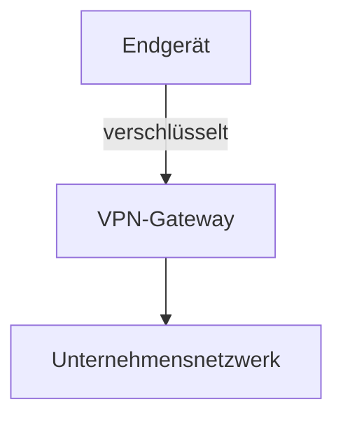
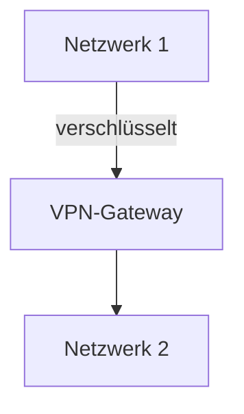
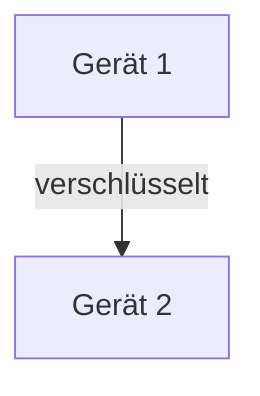

Der Begriff **VPN-Modelle** beschreibt verschiedene Architekturen für virtuelle private Netzwerke, die sichere Verbindungen über unsichere Netze wie das Internet ermöglichen. Diese Modelle, darunter Remote-Access-, Site-to-Site- und Host-to-Host-VPNs, nutzen Tunneling und Verschlüsselung, um Daten vor Abhörung zu schützen und Zugriff auf entfernte Ressourcen zu gewähren. In der Daten- und Prozessanalyse dienen sie zur Sicherung von Datenübertragungen und zur Wahrung der [Datenschutz](datenschutz)-Standards.

## Kurzübersicht

VPN-Modelle definieren, wie Geräte oder Netzwerke über verschlüsselte Tunnel verbunden werden, um Sicherheit und Datenschutz zu gewährleisten. Remote-Access-VPNs verbinden einzelne Geräte mit Netzwerken, Site-to-Site-VPNs verknüpfen mehrere Netzwerke, und Host-to-Host-VPNs ermöglichen direkte Geräte-zu-Geräte-Verbindungen. Protokolle wie OpenVPN und WireGuard sorgen für die Verschlüsselung, während Features wie Split-Tunneling den Datenverkehr optimieren und VPN-Concentrators die Verwaltung erleichtern.

## Kontext und Einordnung

Virtuelle private Netzwerke ergänzen bestehende Sicherheitsmaßnahmen in der Datenanalyse, indem sie verschlüsselte Verbindungen über öffentliche Netze schaffen. Sie bauen auf Technologien wie Verschlüsselungsstandards auf und sind essenziell für Fernzugriff auf Unternehmensdaten oder die Umgehung von Zensur in Analyseprozessen.

## Begriffe und Definitionen

- **Remote-Access-VPN** (auch Client-to-Site): Verbindet ein einzelnes Endgerät mit einem entfernten Netzwerk.
- **Site-to-Site-VPN**: Verbindet zwei oder mehr Netzwerke, etwa Standorte eines Unternehmens.
- **Host-to-Host-VPN** (auch Peer-to-Peer): Verbindet zwei Endgeräte direkt miteinander.
- **Split-Tunneling**: Leitet nur bestimmten Datenverkehr durch den VPN-Tunnel, während anderer direkt über das lokale Netzwerk geht.
- **VPN-Concentrator**: Hardware oder Software, die mehrere VPN-Verbindungen verwaltet und zentralisiert.
- **Kill-Switch**: Funktion, die den Internetzugang automatisch unterbricht, wenn die VPN-Verbindung abbricht.

## Funktionsweise

VPNs erstellen einen verschlüsselten Tunnel zwischen den beteiligten Parteien, um Daten vor unbefugtem Zugriff zu schützen. Der Prozess beginnt mit der Authentifizierung, oft durch Benutzernamen, Passwort oder Zertifikate. Anschließend erfolgt die Verschlüsselung der Datenpakete, typischerweise mit dem Advanced Encryption Standard (AES). VPN-Concentrators oder Gateways verwalten die Verbindungen und sorgen für Stabilität. Features wie Kill-Switch und DNS-Leak-Schutz verhindern Lecks, bei denen Daten versehentlich unverschlüsselt übertragen werden.

## VPN-Protokolle

Verschiedene Protokolle definieren, wie die Verschlüsselung und der Tunnel aufgebaut werden. Sie unterscheiden sich in Sicherheit, Geschwindigkeit und Komplexität. Bekannte Protokolle sind PPTP, [IPsec](ipsec), OpenVPN, IKEv2 und WireGuard.

| Protokoll   | Sicherheit | Geschwindigkeit | Anmerkungen                                                  |
| ----------- | ---------- | --------------- | ------------------------------------------------------------ |
| PPTP        | Niedrig    | Hoch            | Einfach, aber veraltet und unsicher.                         |
| L2TP/IPsec  | Mittel     | Mittel          | Kombiniert L2TP mit IPsec für bessere Sicherheit, langsamer. |
| OpenVPN     | Hoch       | Mittel          | Open-Source, flexibel und sicher.                            |
| IKEv2/IPsec | Hoch       | Hoch            | Stabil, besonders für mobile Geräte.                         |
| WireGuard   | Hoch       | Sehr hoch       | Modern, minimaler Overhead, einfach zu implementieren.       |

## VPN-Modelle

Die Modelle variieren je nach Verbindungsart und Anwendung.

### Remote-Access-VPN

Dieses Modell verbindet ein einzelnes Endgerät mit einem Netzwerk, etwa einem Unternehmensnetzwerk. Es ermöglicht den Zugriff auf Ressourcen, als wäre der Benutzer vor Ort. Split-Tunneling kann hier eingesetzt werden, um nur berufliche Daten durch den Tunnel zu leiten.

### Site-to-Site-VPN

Verbindet zwei oder mehr Netzwerke, beispielsweise Büros an verschiedenen Standorten. Es ermöglicht eine nahtlose Kommunikation zwischen den Netzwerken.

### Host-to-Host-VPN

Verbindet zwei Endgeräte direkt, ideal für private, sichere Kommunikation ohne Netzwerkzwischenschaltung.

## Vorteile

- Datenschutz durch Verschleierung der IP-Adresse und Verschlüsselung.
- Schutz vor Man-in-the-Middle-Angriffen.
- Zugriff auf gesperrte Inhalte oder Ressourcen.
- Features wie No-Logs-Policy bei seriösen Anbietern für zusätzliche Privatsphäre.

## Nachteile

- Mögliche Geschwindigkeitsverluste durch den Umweg über den VPN-Server.
- Kosten für kommerzielle Dienste.
- Abhängigkeit von der Vertrauenswürdigkeit des Anbieters.
- Potenzielle Komplexität bei der Konfiguration von Features wie Split-Tunneling.

## Anwendungsgebiete

- Fernzugriff auf Unternehmensdaten in der Datenanalyse.
- Sicherer Datenaustausch in öffentlichen WLAN-Netzwerken.
- Umgehung von Zensur für den Zugriff auf internationale Ressourcen.
- Verbindung von verteilten Analyseprozessen über verschiedene Standorte.

## Rechtliche Aspekte

Die Nutzung von VPNs unterliegt rechtlichen Rahmenbedingungen. In einigen Ländern ist die Umgehung von Zensur verboten, und Nutzungsbedingungen von Diensten können VPNs untersagen. Datenschutzgesetze wie die DSGVO erfordern Transparenz über die Speicherung von Nutzerdaten. Eine No-Logs-Policy des Anbieters hilft, rechtliche Risiken zu minimieren.

## Häufige Fehler und Tipps

- Fehler: Vergessen von DNS-Leak-Schutz führt zu unverschlüsselten DNS-Abfragen. Leak-Schutz sollte immer aktiviert sein.
- Fehler: Kein Kill-Switch eingestellt führt dazu, dass Daten bei Verbindungsabbruch ungeschützt sind. Der Kill-Switch sollte in der VPN-Software konfiguriert sein.
- Protokollwahl: WireGuard eignet sich für Geschwindigkeit, OpenVPN für maximale Sicherheit.

## Weiterführendes

Für tiefergehende Informationen zu Verschlüsselungsstandards siehe Verschlüsselung. Ergänzende Themen umfassen IPv6-Unterstützung in modernen VPNs und den Vergleich von Enterprise- versus Consumer-VPNs.

